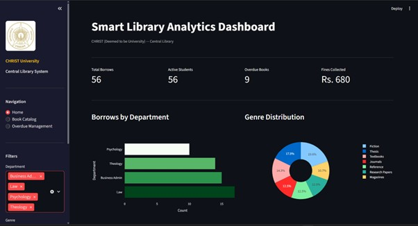
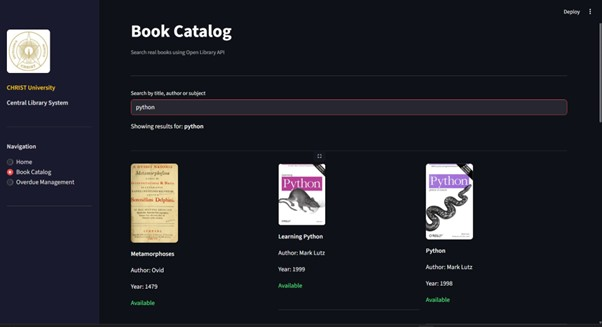
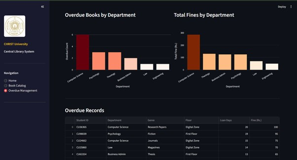

# Smart Library Analytics Dashboard

**CHRIST (Deemed to be University) — Central Library System**

A real-time Smart Library Analytics Dashboard built using Python and Streamlit. The application provides library administrators with insights on book borrowing patterns, overdue management, and a live book search feature using the Open Library API.

---

## Live Application

[https://smart-library-dashboard.streamlit.app/](https://smart-library-dashboard.streamlit.app/)

---

## Screenshots

### Home Page


### Book Catalog


### Overdue Management


---

## Features

**Home Page**
- KPI cards showing Total Borrows, Active Students, Overdue Books and Fines Collected
- Borrows by Department bar chart
- Genre Distribution pie chart
- Most Borrowed Genres bar chart
- Smart Alerts showing overdue count, busiest day, top department and top genre
- Sidebar filters for Department, Genre and Date range

**Book Catalog**
- Search real books by title, author or subject using Open Library API
- Displays real book cover images
- Shows availability status based on library transaction data
- Genre summary table when no search is entered

**Overdue Management**
- KPI cards for Total Overdue, Total Fines, Students with Overdue and Departments Affected
- Overdue Books by Department chart
- Total Fines by Department chart
- Full overdue records table
- Download overdue records as CSV
- Filter by department

---

## Technology Stack

- Python
- Streamlit
- Plotly Express
- Pandas
- Requests
- Open Library API

---

## Project Files

```
dashboard.py                  — Main application
christ_library_100_rows.csv   — Library transaction dataset
christ_logo.jpg               — CHRIST University logo
requirements.txt              — Dependencies
```

